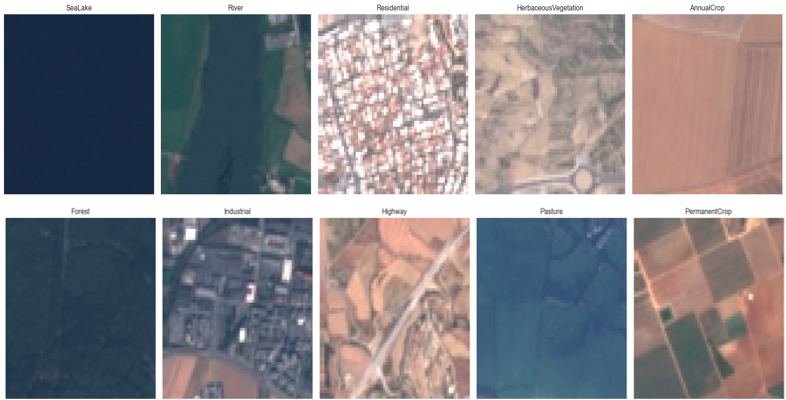
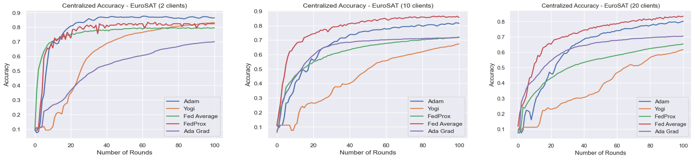
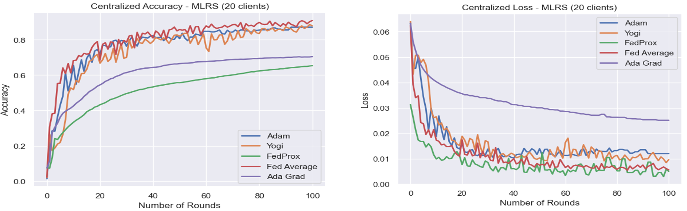

## Rafflesia: Design of a Largescale Federated Learning Benchmark
Federated Learning (FL) is a technique for training ML in a privacy-preserving manner by eliminating the requirement to collect data and store it in a centralised location. It offers an approach where multiple devices collaboratively train a model under the guidance of a central server while keeping the training data on the devices. In this approach, data is not transferred or exchanged but processed locally on each device and only updates are aggregated to achieve learning objectives 

This repository contain the logics of the project aimed at designing and implementing a benchmark system for FL. Currently, FL is limited by the lack of benchmarks that are scalable and suitable for real world scenarios. We design and implement Rafflesia, a benchmark system that consists of two large datasets that are suitable for FL applications.

To the best of our knowledge, Rafflesia is the first large-scale FL experiment using remote sensing. 

## Dataset Choices
We used two large publicly-available satellite imagery datasets:
1. EuroSAT and 
2. MLRSNet.
Selected datasets varies dramatically in terms of number of images per category & sizes, and other attributes as they are taken from different satellites, weather conditions, geographical conditions and activities captured.

 

## Experimental Results
 


## Installation
1. Clone the repository: `git clone https://github.com/classicalmuheeb/rafflesia`
2. Navigate to the project directory. 
3. Install dependencies: `pip install -r requirements.txt`

## Usage
### To run the application, follow these steps:
 - Move into the project's directory and run these commands based on your choices:
 
```bash
!python fed_avg.py --balanced=True --strategy=FedAvg --batch_size=32 --num_clients=20 --num_rounds=100

```bash
!python fed_prox.py --iid=True --strategy=FedProx --batch_size=10 --num_rounds=20 --num_clients=50